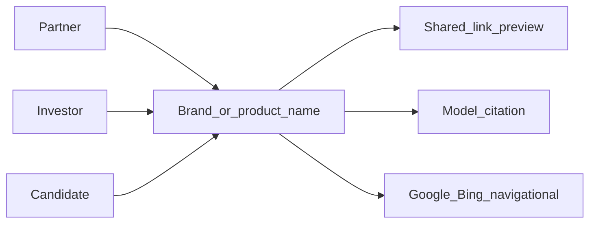

# CPH4.AI 官网 SEO 工作流

日期：2026-08-16  
站点语言：英文  
观众：合作方、投资人、候选人（与 [website-brief.md](./website-brief.md) 一致：人才、合作方、资方）  
范围：`cph4.ai` 母站。产品站（如 [kuaizengji.com](https://www.kuaizengji.com/)）各自独立。

本文是英文出海官网的 SEO / 发现与信任规范。改站、改文案、加产品条目，以 [website-brief.md](./website-brief.md) 为准；本文只管「如何被搜到、被信任、被模型说对」。

改编自 [鱼厂 SEO 优化工作流](https://github.com/liyupi/free-video-downloader/blob/master/%E9%B1%BC%E5%8E%82%20SEO%20%E4%BC%98%E5%8C%96%E5%B7%A5%E4%BD%9C%E6%B5%81.md)。鱼厂面向中文内容站（题库/教程 + 百度）。我们是页面很少的英文母站，流量来自品牌检索、转发链接、模型推荐——不是海量需求词。

---

## 1. 适用范围与和 Brief 的关系

| 文档 | 管什么 | 不管什么 |
|---|---|---|
| [website-brief.md](./website-brief.md) | 身份、观众、红线、IA、英文文案 | 爬虫、站长平台、Meta 细则 |
| 本文 | 发现、抓取、实体、分享预览、检查清单 | 改 slogan、加假文章、抢大词 |

**Brief 优先**：空博客 / 空岗位可接受；不为 SEO 加客户墙、假 JD、年龄、竞品名、哈夫克叙事、Verdict 定价、未做的医疗线。

**引擎**：Google、Bing、ChatGPT / Perplexity / Google AI Overviews。  
**不做**：百度、360、搜狗、微信生态、`keywords` meta、AMP。

**语言**：`html lang="en"`，`og:locale=en_US`。单语言站；`hreflang=en` + `x-default` 可留，不作为优先级。

---

## 2. 成功标准

三类人怎么找到我们，决定优化什么。第一目标是 **实体正确 + 分享可用 + 源码可抓**，不是关键词覆盖率。



| 观众 | 典型入口 | 页面要证明的事 | 不优化的事 |
|---|---|---|---|
| 合作方 | 搜公司/产品名、被转发、问模型「这是谁」 | 在做什么、哪条 Live、怎么联系 | 抢「AI tutoring」这类大词 |
| 投资人 | 搜公司/创始人、看 deck 里的链接 | 真实状态、团队、诚实边界 | 把母站写成融资页 |
| 候选人 | 搜公司 + Careers、同事转发 | 谁在做、团队态度、如何写信 | 空岗墙、假 JD |

---

## 3. 从鱼厂清单：留 / 改 / 丢

避免以后把中文站条款搬回来。

### 3.1 留（引擎无关）

| 条款 | 为什么 |
|---|---|
| 每页唯一 Title / Description | Google / Bing snippet 与分享预览都依赖 |
| 每页一个 H1，层级不跳 | 语义结构，不是「百度技巧」 |
| canonical | 防重复、锚点页与实体页对齐 |
| robots.txt + XML sitemap | 发现机制 |
| OG（绝对路径图）+ Twitter Card | 合作方 / 投资人 / 候选人转发时的第一眼 |
| 图片 alt、描述性锚文本 | 可访问性 + 理解 |
| JSON-LD | Google 明确偏好；帮助实体识别 |
| HTTPS、响应式、合理速度 | 排名与体验信号 |

### 3.2 改（同一原则，换英文规则）

| 鱼厂写法 | 我们怎么做 |
|---|---|
| Title 按百度约 30 汉字、核心词死前置 | 按 Google 像素宽度，约 **50–60 字符**；自然语句；Google 常改写 title |
| Description 兼顾百度约 200 字 | 只按 Google：**150–160 字符**，前 120 字放价值 |
| Keywords「建议保留给百度」 | **不加** |
| itemprop 微数据 + JSON-LD 双写 | **只保留 JSON-LD** |
| Twitter Card「国际化可选」 | 英文站 **必做** |
| 外链一律 `nofollow` | 仅广告 / 不信任 / UGC；权威来源 **follow** |
| `rel="prev/next"` 分页 | Google 已停用；有分页用 canonical 或独立内容 |
| 提交百度 / 360 / 搜狗 | **Google Search Console + Bing Webmaster** |
| 5118、百度词规划师 | Google Keyword Planner、Ahrefs、AlsoAsked（仅当要做需求页时） |
| 微信分享调试 | Facebook Debugger、Twitter Card Validator、LinkedIn Inspector |
| 内容「不少于 500 字」 | 英文看意图是否被满足；母站保持 brief 的短文案 |

### 3.3 丢（中国市场残留）

- `meta name="keywords"`
- `X-UA-Compatible`（IE）
- 为百度单独加长 Description
- AMP
- 外链一律 nofollow
- 把「关键词密度 / 核心词必须出现在 H1 前半」当硬指标

---

## 4. 现站审计（2026-08-16）

对照实现写「已有 / 缺口 / 有意不做」。文案与 IA 不因 SEO 推翻 brief。

| 项 | 现状 | 判定 |
|---|---|---|
| 首页 TDK / OG / Twitter / JSON-LD Organization + WebSite + WebPage | [`index.html`](../index.html) 已齐 | **保持** |
| 产品页独立 TDK + Product / SoftwareApplication schema | [`products/*.html`](../products/kuaizengji.html) 已齐 | **保持** |
| 产品页 H1 / 正文 | 四页静态 HTML 已含 H1 + lede + 两段（+ Live CTA）；[`page.ts`](../page.ts) 用 `productPageInnerHtml` 增强 | **已做** |
| Capabilities | 仅 `#capabilities`；长介绍 JS 悬停注入；静态里有能力名 + one-liner（`.visually-hidden`） | **有意**（brief：无子页）。长介绍可继续悬停 |
| Company / Careers 段 | 仅 `#company` / `#careers` | **有意**；品牌检索落首页即可 |
| 空博客入口 | [`blog/index.html`](../blog/index.html)：`noindex, follow`，跳回 `#blogs`，canonical 指首页 | **有意**：无文不索引。有文后：独立 canonical、可索引、进 sitemap，去掉跳转 |
| Sitemap | [`public/sitemap.xml`](../public/sitemap.xml)：首页 + 4 产品，不含 blog | **正确** |
| robots.txt | [`public/robots.txt`](../public/robots.txt)：`Allow: /` + Sitemap | **保持** |
| Careers JD | [`site.ts`](../site.ts) `jobs = []`，无 `careers/` | **有意**；有岗再加页 + `JobPosting` |
| 首页 H1 | `Intelligence, without end.` 与 Title 相关但不重复 | **符合** |
| CTA 邮箱 | `nemoarce2007@gmail.com` | **后续弱项**（信任/专业感）；不在本文改业务邮箱 |

---

## 5. 页面模板 TDK

分隔符沿用现站：短横线语境用 `—`，品牌分隔用 `|`。  
每个索引页 Title / Description **必须唯一**，与页面内容一致，不堆砌。

| 模板 | 路径 | Title 模板 | Description 原则 | 现站范例 |
|---|---|---|---|---|
| 首页 | `/` | `CPH4.AI — Intelligence, without end.` | 组织是谁；可被人才/合作/资方读懂；不堆产品词 | 已锁定 |
| 产品页 | `/products/{slug}.html` | `{Name} — {one-liner 压缩} \| CPH4.AI` | 状态诚实（Live / Coming / Demo / Building）+ 一句价值 + Built by CPH4.AI（或等价） | `Kuaizengji — Coursework-native AI \| CPH4.AI` |
| 岗位页 | `/careers/{slug}.html`（有岗才建） | `{Role} — Careers — CPH4.AI` | 地点 · 类型 + 一句 + 如何联系 | 尚无 |
| 博文 | `/blog/{slug}.html`（有文才建） | `{Title} — CPH4.AI` | 摘要前约 150 字符 | 尚无 |
| 空博客入口 | `/blog/` | 可保留短 Title | **`noindex`**，不进 sitemap，直到有文 | 已如此 |

**长度**：Title 约 50–60 字符；Description 约 150–160 字符（含空格）。以可读为准，不为凑字数。

**OG / Twitter**：标题与描述可与页面一致或略短；`og:image` 必须用绝对 URL（现为 `https://cph4.ai/og.png`）。

---

## 6. 必需 Meta 与结构化数据

### 6.1 每个索引页必须有

```
charset UTF-8
viewport
html lang="en"
unique <title>
unique meta description
meta robots（默认可 index, follow；空壳页用 noindex）
link rel="canonical"（绝对 URL）
og:type / og:site_name / og:locale / og:url / og:title / og:description / og:image（绝对路径）
twitter:card / twitter:title / twitter:description / twitter:image
```

**不要**：`keywords` meta。

可选保留：`hreflang="en"` + `x-default`（单语言，低优先级）。

### 6.2 JSON-LD（只写一种，不要再加 itemprop）

| 页面 | 类型 | 备注 |
|---|---|---|
| 首页 | Organization + WebSite + WebPage | 已有；含 founder、logo、slogan |
| 产品页 | Product 和/或 SoftwareApplication + WebPage | Live 可带 Offer URL；Coming / Demo / Building 不假装 InStock 乱写可用性 |
| 岗位页 | JobPosting | **有真实 JD 才加** |
| 博文 | Article | **有文才加** |

**Verdict（金融相关）**：不编造 Review / AggregateRating；不写价格（brief 红线）。  
**Kuaizengji**：现有 Review 可保留；不扩散到未上线产品。

### 6.3 推荐 Head 结构（逻辑顺序）

与现站一致即可：基础 → robots/canonical → OG → Twitter → favicon → JSON-LD。不必抄中文站示例里的百度向标签。

---

## 7. 结构标签与抓取

### 7.1 标题层级

| 规则 | 说明 |
|---|---|
| 一页一 H1 | 首页已有；产品 / 岗位页 H1 必须在 **静态 HTML** 中，不能只靠 [`page.ts`](../page.ts) |
| H2–H3 | 章节用；不跳级 |
| H1 ≠ Title 原文 | 相关即可（首页已符合） |

### 7.2 链接

| 规则 | 说明 |
|---|---|
| 锚文本 | 描述目标（产品名、段落名）；避免「点击这里」 |
| 外链产品站 | `target="_blank"` + `rel="noopener noreferrer"`（或 `noreferrer`） |
| nofollow | 仅广告 / 不信任 / UGC |
| 内链 | 页脚 Products 链到各介绍页；重要 Live 产品优先被链到 |

### 7.3 图片

| 规则 | 说明 |
|---|---|
| alt | 内容图必填、独特；装饰性 canvas / 纹理用 `alt=""` 或 `aria-hidden` |
| Logo | 已有描述性 alt，保持 |
| 文件名 | 描述性英文 + 连字符（如 `og.png`、`cph4_logo.svg`） |
| OG 图 | 绝对 URL；建议约 1200×630，现站尺寸可接受 |

### 7.4 爬虫友好

| 文件 | 规则 |
|---|---|
| [`public/robots.txt`](../public/robots.txt) | 允许索引页；勿误拦 CSS/JS；保留 Sitemap 行 |
| [`public/sitemap.xml`](../public/sitemap.xml) | 只列应被索引的 URL；空 blog / 空 careers **不进**；新索引页同步更新 |
| 渲染 | 核心文案（H1、产品段落、Company、Careers 态度）应在禁用 JS 时仍可读——或至少出现在初始 HTML |

### 7.5 Capabilities 特殊说明

Brief：Capabilities 无独立介绍页。SEO 底线：首页静态 HTML 中可见能力 **名称**（及 brief 中的 one-liner，若写进静态更好）。悬停长文可继续 JS。不要为了 SEO 拆出八个薄页，除非 brief 改 IA。

---

## 8. 内容与信任（三类人）

不要求「每页 ≥500 字」。不为 SEO 发假文章（brief：空列表可接受）。

| 信号 | 合作方 | 投资人 | 候选人 |
|---|---|---|---|
| 产品状态诚实 | 知道谁 Live、谁能谈 | 知道什么是器物、什么在建 | 知道自己会做什么 |
| 创始人可见 | 对手是谁 | 团队是否成立 | 跟谁干活 |
| 可转发预览 | OG 不空 | deck 链接打开像样 | 同事转发不丢图 |
| 模型说得对 | 名称、Live 产品、联系方式 | 不把 Coming 说成已上线 | Careers 态度不被编造 |

**AEO（与 Capabilities 条目一致）**：公开记录写清实体名、状态、一句话。避免模型把 Studio 说成已做成的平台公司——对齐 brief「工作室的诚实结构」。

有文再写：深度、可引用、带日期与作者实体，利于品牌与模型引用——仍服从 brief 红线。

---

## 9. 检查清单

### 9.1 每个索引页必须有

- [ ] 唯一 Title（约 50–60 字符，可读）
- [ ] 唯一 Description（约 150–160 字符）
- [ ] 无 `keywords` meta
- [ ] 唯一 H1，且在 **静态 HTML** 中
- [ ] canonical 指向本页规范 URL
- [ ] robots 正确（索引页 index；空壳 noindex）
- [ ] OG：title、description、image（绝对路径）、url、type、locale、site_name
- [ ] Twitter Card：summary_large_image + title / description / image
- [ ] 合适的 JSON-LD（见第 6 节）
- [ ] `lang="en"`、charset、viewport

### 9.2 上线前 / 发布变更时

- [ ] [`sitemap.xml`](../public/sitemap.xml) 与索引页一致
- [ ] [`robots.txt`](../public/robots.txt) 未误拦
- [ ] 禁用 JS 抽查：首页关键文案、产品页 H1/正文是否在源码中
- [ ] OG 预览：Facebook Debugger / Twitter Card Validator / LinkedIn
- [ ] Google Rich Results Test（有 JSON-LD 的页）
- [ ] 提交 / 验证：Google Search Console、Bing Webmaster（sitemap）

### 9.3 有文 / 有岗才做

- [ ] 博文：独立 HTML、可索引、Article JSON-LD、进 sitemap；去掉空入口的 noindex 跳转策略或改为列表页
- [ ] 岗位：`careers/{slug}.html` + `site.ts` jobs + JobPosting；空岗不展示、不索引空墙
- [ ] 内链：从 Careers / Blogs 段链到真实页

### 9.4 已知技术债（单独排期，本文不改代码）

| 债 | 做法 | 不做 |
|---|---|---|
| ~~产品页正文仅 JS 注入~~ | **已做**：静态 HTML 预渲染；`productPageInnerHtml` 为运行时同源 | — |
| 空 blog canonical 指首页 | 有文前保持 noindex 即可；有文后改为自身 URL | 不为空壳求收录 |
| 个人 Gmail 作对外 CTA | 后续换组织邮箱时再改 | 本文不改业务流程 |

---

## 10. 明确不做

与 brief 红线对齐，并加上 SEO 禁区：

- 不为 SEO 加客户墙、假文章、假岗位
- 不上年龄、失败产品名、竞品名、哈夫克 / 超国家叙事、Verdict 定价、量化细节、未启动医疗线
- 不自称已做成的平台公司；不把 Coming / Demo / Building 写成 Live
- 不加 `keywords`；不提交百度系；不做 AMP
- 不为 SEO 把 Capabilities 拆成一堆薄着陆页（除非 brief 改 IA）
- 不把母站做成融资页或单一产品站

---

## 11. 实施优先级

| 优先级 | 做什么 | 说明 |
|---|---|---|
| P1 | ~~产品页（及将来岗位页）正文进静态 HTML~~ | **产品页已做**；有岗时同法预渲染 |
| P1 | 保持现有 TDK / OG / Twitter / JSON-LD；GSC + Bing | Meta 已齐；补站长平台 |
| P2 | 有真实证据时加深产品页 / 发可引用笔记 | 仍服从 brief；不凑字数 |
| P2 | Verdict 等金融向页：信任与免责表述（若对外加深） | 不编造评分与价格 |
| P3 | FAQ / 作者实体、AEO 向公开记录 | 有内容再加 Schema |
| 不做 | 见第 10 节 | — |

---

## 12. 工具（英文出海）

| 用途 | 工具 |
|---|---|
| 收录与错误 | Google Search Console、Bing Webmaster Tools |
| 速度 | PageSpeed Insights |
| 结构化数据 | Google Rich Results Test |
| 分享预览 | Facebook Sharing Debugger、Twitter Card Validator、LinkedIn Post Inspector |
| 全站扫描（可选） | Screaming Frog（查重复 TDK、死链） |

---

## 13. 总结

| 原则 | 含义 |
|---|---|
| Brief 优先 | 身份与诚实结构 > 排名技巧 |
| 实体正确 | 名称、状态、团队、联系方式可被引擎与模型转述对 |
| 源码可抓 | 关键文案在 HTML 里，不只在 JS 里 |
| 分享可用 | OG / Twitter 完整，绝对路径图 |
| 少而准 | 索引该索引的；空壳 noindex；不为大词建薄页 |

母站 SEO 做成：**搜得到公司与产品名，点开像回事，模型说得对，合作方 / 投资人 / 候选人信得过。** 其余内容站玩法，不适用于现在的 `cph4.ai`。
